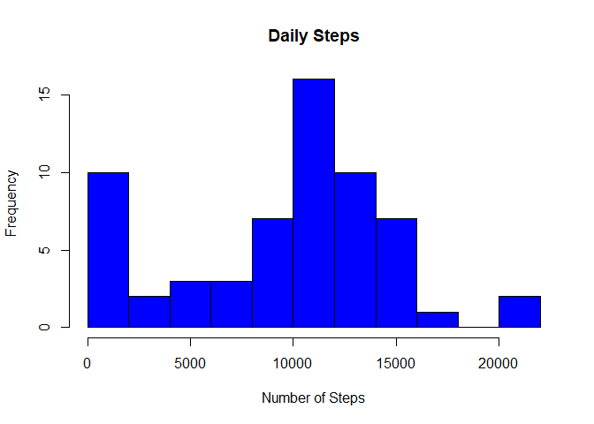
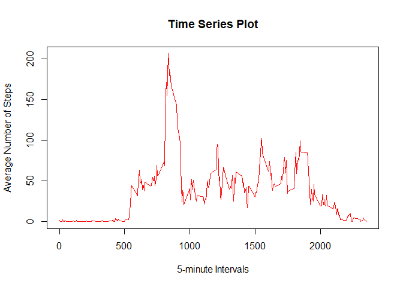
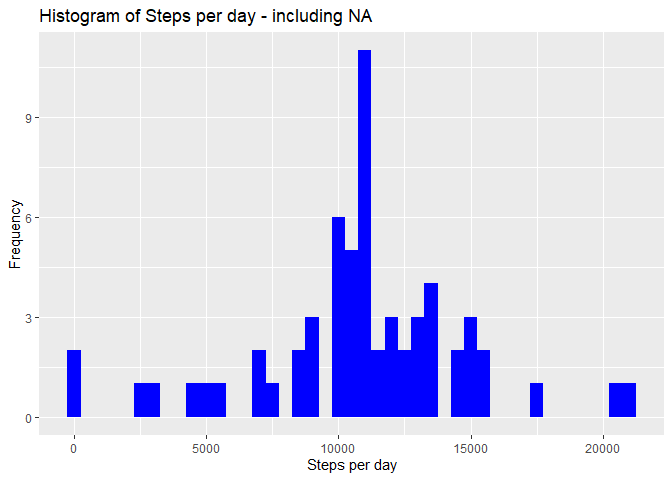
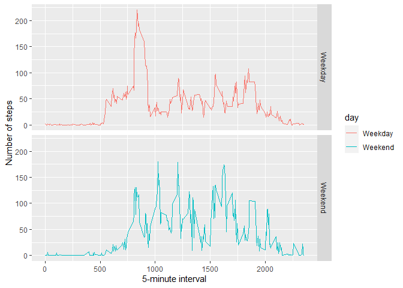

## Introduction

This assignment makes use of data from a personal activity monitoring device using activity monitoring devices, such as a Fitbit (http://www.fitbit.com), Nike Fuelband (http://www.nike.com/us/en_us/c/nikeplus- fuelband), or Jawbone Up (https://jawbone.com/up). This device collects data at 5 minute intervals through out the day. The data consists of two months of data from an anonymous individual collected during the months of October and November, 2012 and include the number of steps taken in 5 minute intervals each day.


## The data for this assignment was downloaded from the course web site:

Dataset: Activity monitoring data (https://d396qusza40orc.cloudfront.net/repdata%2Fdata%2Factivity.zip) [52K] The dataset is stored in a comma-separated-value (CSV) file and there are a total of 17,568 observations in this dataset.

## The variables included in this dataset are:

    steps: Number of steps taking in a 5-minute interval (missing values are coded as NA ) 2
    date: The date on which the measurement was taken in YYYY-MM-DD format
    interval: Identifier for the 5-minute interval in which measurement was taken

## R preparations

```r
library(knitr)
opts_chunk$set(echo = TRUE)
```

## Load in the necessary packages

```r
library(dplyr)
```

```
## 
## Attaching package: 'dplyr'
```

```
## The following objects are masked from 'package:stats':
## 
##     filter, lag
```

```
## The following objects are masked from 'package:base':
## 
##     intersect, setdiff, setequal, union
```

```r
library(lubridate)
```

```
## 
## Attaching package: 'lubridate'
```

```
## The following objects are masked from 'package:base':
## 
##     date, intersect, setdiff, union
```

```r
library(ggplot2)
```

## Loading and preprocessing the data

```r
# getwd() save the data.
data<-read.csv("./activity.csv",header=TRUE,sep=",",na.strings="NA",colClasses = c("numeric","Date","numeric"))
str(data)
```

```
## 'data.frame':	17568 obs. of  3 variables:
##  $ steps   : num  NA NA NA NA NA NA NA NA NA NA ...
##  $ date    : Date, format: "2012-10-01" "2012-10-01" ...
##  $ interval: num  0 5 10 15 20 25 30 35 40 45 ...
```

## What is mean total number of steps taken per day?

For this part of the assignment, you can ignore the missing values in the dataset.

    1.- Calculate the total number of steps taken per day


```r
tab1<-tapply(data$steps,data$date,function(x) sum(x,na.rm=TRUE))
hist(tab1, breaks = 15, col="blue",xlab="Number of Steps", main="Daily Steps")
```

<!-- -->

    2.- Calculate and report the mean and median total number of steps taken per day
    

```r
# Mean total number of steps taken per day (Promedio total numero de pasos por dia)
prom<-mean(tab1,na.rm=TRUE)
prom
```

```
## [1] 9354.23
```

```r
# Median total number of steps taken per day:
mediana<- median(tab1,na.rm=TRUE)
mediana
```

```
## [1] 10395
```

```r
#Statistical summary of the data (Resumen Estadistico de los datos).
summary(tab1)
```

```
##    Min. 1st Qu.  Median    Mean 3rd Qu.    Max. 
##       0    6778   10395    9354   12811   21194
```

## What is the average daily activity pattern?
    
    1.- Time series plot (i.e. type = “l” ) of the 5-minute interval (x-axis) and the average number of steps taken, averaged across all days (y-axis)


```r
patronpaso <- aggregate(data$steps ~ data$interval, data, FUN=mean, na.rm=TRUE)
names(patronpaso) <- c("interval","average_steps")

plot(patronpaso$average_steps ~ patronpaso$interval, col="red",
       type = "l", ylab = "Average Number of Steps", 
       xlab ="5-minute Intervals",
       main = "Time Series Plot", lwd = 1)
```

<!-- -->


    2.- Which 5-minute interval, on average across all the days in the dataset, contains the maximum number of steps?

```r
max_indice <- which.max(patronpaso$average_steps)

valormax<-patronpaso$average_steps[max_indice]

valortime<-patronpaso$interval[max_indice]

result<-data.frame(valormax,valortime)
result
```

```
##   valormax valortime
## 1 206.1698       835
```
## Imputing missing values

    1.- Calculate and report the total number of missing values in the dataset (i.e. the total number of rows with NA s)

```r
sum(is.na(data$steps))
```

```
## [1] 2304
```

    2.- Device a strategy for filling in all of the missing values in the dataset. The strategy does not need to be sophisticated. For example, you could use the mean/median for that day, or the mean for that 5- minute interval, etc.


```r
data_new <- data
nas <- is.na(data_new$steps)
prom_interval <- tapply(data_new$steps, data_new$interval, mean, na.rm=TRUE)
```

    3.- Create a new dataset that is equal to the original dataset but with the missing data filled in.

```r
# create the new dataset step 2 and verify no NA's
data_new$steps[nas] <- prom_interval[as.character(data_new$interval[nas])]
sum(is.na(data_new$steps))
```

```
## [1] 0
```

```r
head(data_new)
```

```
##       steps       date interval
## 1 1.7169811 2012-10-01        0
## 2 0.3396226 2012-10-01        5
## 3 0.1320755 2012-10-01       10
## 4 0.1509434 2012-10-01       15
## 5 0.0754717 2012-10-01       20
## 6 2.0943396 2012-10-01       25
```

    4.- Make a histogram of the total number of steps taken each day and Calculate and report the mean and median total number of steps taken per day. Do these values differ from the estimates from the first part of the assignment? What is the impact of imputing missing data on the estimates of the total daily number of steps?
    

```r
steps_new <- data_new %>%
  filter(!is.na(steps)) %>%
  group_by(date) %>%
  summarize(steps = sum(steps)) %>%
  print
```

```
## `summarise()` ungrouping output (override with `.groups` argument)
```

```
## # A tibble: 61 x 2
##    date        steps
##    <date>      <dbl>
##  1 2012-10-01 10766.
##  2 2012-10-02   126 
##  3 2012-10-03 11352 
##  4 2012-10-04 12116 
##  5 2012-10-05 13294 
##  6 2012-10-06 15420 
##  7 2012-10-07 11015 
##  8 2012-10-08 10766.
##  9 2012-10-09 12811 
## 10 2012-10-10  9900 
## # ... with 51 more rows
```


```r
ggplot(steps_new, aes(x = steps)) +
  geom_histogram(fill = "blue", binwidth = 500) +
  labs(title = "Histogram of Steps per day - including NA", x = "Steps per day", y = "Frequency")
```

<!-- -->

### Calculate the mean and median steps with the filled in values:


```r
prom_steps_new <- mean(steps_new$steps, na.rm = TRUE)
mediana_steps_new <- median(steps_new$steps, na.rm = TRUE)

results<-data.frame(prom_steps_new,mediana_steps_new)
results
```

```
##   prom_steps_new mediana_steps_new
## 1       10766.19          10766.19
```

## Are there differences in activity patterns between weekdays and weekends?


```r
tipo_dia <- function(date) {
  if (weekdays(as.Date(date)) %in% c("sabado", "domingo")) {
    "Weekend"
  } else {
    "Weekday"
  }
}
data_new$tipo_dia <- as.factor(sapply(data_new$date, tipo_dia))
data_new$day <- sapply(data_new$date, FUN = tipo_dia)

promedios <- aggregate(steps ~ interval + day, data = data_new, mean)
ggplot(promedios, aes(interval, steps,color=day)) + geom_line() + facet_grid(day~.) + 
    xlab("5-minute interval") + ylab("Number of steps")
```

<!-- -->
